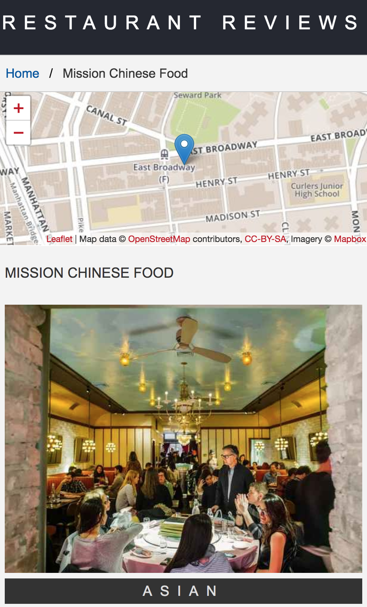

# PWA_Restaurant
Sample Project PWA Restaurant for presentation and training Google Developer Kejar 2018 batch 1
## Contents
1. Installation
2. Usage
   i. Run the front-end and the back-end implementations
   ii. Get a MapBox API key and the map on screen
3. PWA - Restaurant Reviews showcase
4. Stage 1 Submission
   i. Result presentation
   ii. Final site performance 
      - using audit results, with Chrome Lighthouse DevTool
5. Stage 2 Submission
   i. Introductory note
   ii. Final site performance 
      - using audit results, with Chrome Lighthouse DevTool
6. Stage 3 Submission
   i. Introductory note
   ii. Final site performance 
      - using audit results, with Chrome Lighthouse DevTool
7. Previous forked [Readme.md](https://github.com/udacity/mws-restaurant-stage-1/blob/master/README.md)
    i. Stage-1 Task Specifications 
    ii. Stage-2 Task Specifications 
    iii. Stage-3 Task Specifications 


### 1. Installation
---

> You should have a package manager like [npm](https://www.npmjs.com/) or [yarn](https://yarnpkg.com/) installed. 

Then:

```
npm install
cd server && npm install && cd ..
```
with the above commands, all packages that this project has as dependencies will be installed.


### 2. Usage
---
#### i. Run the front-end and the back-end
> You should have a package manager like [npm](https://www.npmjs.com/) or [yarn](https://yarnpkg.com/) installed. 

Then:

Open 2 different terminals/shells, one devoted to the front-end and one to the back-end

Start the 2 ends:

**Backend**
```
npm run server
```
with the server script, a node server will be setup and listen on port 1337

**Frontend**
```
npm run start
```
with the start script, a live server will be setup and listen on port 8080

> The above scripts are cleaning, building and running the application. See more in [package.json](./package.json).

#### ii. Get a MapBox API key and the map on screen

#####  Get a [MapBox API key](https://www.mapbox.com/install/)
* If you do not already have a MapBox account, go ahead and create one
* MapBox API is free to use (no need to provide any payment information)

##### Get the map on the screen

* Head over to your account and create a token. Replace the text `<your MAPBOX API KEY HERE>` inside of `main.js` with your key
* Now, what about rendering the map for individual restaurants? Check out `restaurant_info.js`. Where would be a good spot to place your API key?

### 3. PWA - Restaurant Reviews showcase
---


### 4. Stage 1 Submission
---
#### i. Result presentation





#### ii. Final site performance (using audit results, with Chrome Lighthouse DevTool)

#### Before:

#### After:


### 5. Stage 2 Submission
---
#### i. Introductory note
At the project: Stage-2 beginning, I was looking into using `git subtree` or `git submodules` but finally decided to just merge the `udacity/mws-restaurant-stage-2` in here in a seperate folder **`server`**. The reason I did this was because what was provided in **Stage-2** and in **Stage-3** is almost ready and doesn't need to be touched by me. Nevertheless, I created a new branch and a corresponding commit showing this merge between the two projects. From now on, this repository is going to be the main repository for all stages of the project. 

What is more, in addition to the above, I decided to keep the package.json and the individual corresponding [server/README.md](./server/README.md), [server/.gitignore](./server/.gitignore), etc. files of the merged repo `udacity/mws-restaurant-stage-2` in the folder server in order to be able for someone to install it seperately.

#### ii. Final site performance (using audit results, with Chrome Lighthouse DevTool)


#### Before:

#### After:


### 6. Stage 3 Submission
---
#### i. Introductory note
In this phase I also implemented three additional features. 
* Added a validation form, 
* created a functionable filtering for favorites selections dropdown,
* created the favorite toggle to work also from index page.

#### ii. Final site performance (using audit results, with Chrome Lighthouse DevTool)


#### Before:

#### After:


### 7. Mobile Web Specialist Certification Course
---
#### _Three Stage Course Material Project - Restaurant Reviews_
---
#### i. Stage-1 Task Specifications 

##### Project Overview
For the **Restaurant Reviews** projects, you will incrementally convert a static webpage to a mobile-ready web application. In **Stage One**, you will take a static design that lacks accessibility and convert the design to be responsive on different sized displays and accessible for screen reader use. You will also add a service worker to begin the process of creating a seamless offline experience for your users.

##### Specification

You have been provided the code for a restaurant reviews website. The code has a lot of issues. It’s barely usable on a desktop browser, much less a mobile device. It also doesn’t include any standard accessibility features, and it doesn’t work offline at all. Your job is to update the code to resolve these issues while still maintaining the included functionality. 

##### What do I do from here?

1. In this folder, start up a simple HTTP server to serve up the site files on your local computer. Python has some simple tools to do this, and you don't even need to know Python. For most people, it's already installed on your computer. 

In a terminal, check the version of Python you have: `python -V`. If you have Python 2.x, spin up the server with `python -m SimpleHTTPServer 8000` (or some other port, if port 8000 is already in use.) For Python 3.x, you can use `python3 -m http.server 8000`. If you don't have Python installed, navigate to Python's [website](https://www.python.org/) to download and install the software.

2. With your server running, visit the site: `http://localhost:8000`, and look around for a bit to see what the current experience looks like.
3. Explore the provided code, and start making a plan to implement the required features in three areas: responsive design, accessibility and offline use.
4. Write code to implement the updates to get this site on its way to being a mobile-ready website.

##### Leaflet.js and Mapbox:

This repository uses [leafletjs](https://leafletjs.com/) with [Mapbox](https://www.mapbox.com/). You need to replace `<your MAPBOX API KEY HERE>` with a token from [Mapbox](https://www.mapbox.com/). Mapbox is free to use, and does not require any payment information. 

##### Note about ES6

Most of the code in this project has been written to the ES6 JavaScript specification for compatibility with modern web browsers and future proofing JavaScript code. As much as possible, try to maintain use of ES6 in any additional JavaScript you write. 

#### ii. Stage-2 Task Specifications 

##### Project Overview
For the **Restaurant Reviews** projects, you will incrementally convert a static webpage to a mobile-ready web application. In **Stage Two**, you will take the responsive, accessible design you built in Stage One and connect it to an external server. You’ll begin by using asynchronous JavaScript to request JSON data from the server. You’ll store data received from the server in an offline database using IndexedDB, which will create an app shell architecture. Finally, you’ll work to optimize your site to meet performance benchmarks, which you’ll test using [Lighthouse](https://developers.google.com/web/tools/lighthouse/).

##### Specification
You will be provided code for a Node development server and a README for getting the server up and running locally on your computer. The README will also contain the API you will need to make JSON requests to the server. Once you have the server up, you will begin the work of improving your **Stage One** project code.

The core functionality of the application will not change for this stage. Only the source of the data will change. You will use the `fetch()` API to make requests to the server to populate the content of your Restaurant Reviews app.

##### Requirements
**Use server data instead of local memory** In the first version of the application, all of the data for the restaurants was stored in the local application. You will need to change this behavior so that you are pulling all of your data from the server instead, and using the response data to generate the restaurant information on the main page and the detail page.

**Use IndexedDB to cache JSON responses** In order to maintain offline use with the development server you will need to update the service worker to store the JSON received by your requests using the IndexedDB API. As with **Stage One**, any page that has been visited by the user should be available offline, with data pulled from the shell database.

**Meet the minimum performance requirements** Once you have your app working with the server and working in offline mode, you’ll need to measure your site performance using [Lighthouse](https://developers.google.com/web/tools/lighthouse/).

Lighthouse measures performance in four areas, but your review will focus on three:

* **Progressive Web App** score should be at 90 or better.
* **Performance** score should be at 70 or better.
* **Accessibility** score should be at 90 or better.

You can audit your site's performance with Lighthouse by using the Audit tab of Chrome Dev Tools.

#### ii. Stage-3 Task Specifications 

##### Project Overview
For the **Restaurant Reviews** projects, you will incrementally convert a static webpage to a mobile-ready web application. In **Stage Three**, you will take the connected application you yu built in Stage One and Stage Two and add additional functionality. You will add a form to allow users to create their own reviews. If the app is offline, your form will defer updating to the remote database until a connection is established. Finally, you’ll work to optimize your site to meet even stricter performance benchmarks than the previous project, and test again using [Lighthouse](https://developers.google.com/web/tools/lighthouse/).

##### Specification
You will be provided code for an updated [Node development server](https://github.com/udacity/mws-restaurant-stage-3) and a README for getting the server up and running locally on your computer. The README will also contain the API you will need to make JSON requests to the server. Once you have the server up, you will begin the work of improving your **Stage Two** project code.

> This server is different than the server from stage 2, and has added capabilities. Make sure you are using the **Stage Three** server as you develop your project. Connecting to this server is the same as with **Stage Two**, however.

You can find the documentation for the new server in the README file for the server.

Now that you’ve connected your application to an external database, it’s time to begin adding new features to your app.


##### Requirements
**Add a form to allow users to create their own reviews:** In previous versions of the application, users could only read reviews from the database. You will need to add a form that adds new reviews to the database. The form should include the user’s name, the restaurant id, the user’s rating, and whatever comments they have. Submitting the form should update the server when the user is online.

**Add functionality to defer updates until the user is connected:** If the user is not online, the app should notify the user that they are not connected, and save the users' data to submit automatically when re-connected. In this case, the review should be deferred and sent to the server when connection is re-established (but the review should still be visible locally even before it gets to the server.)

**Meet the new performance requirements:** In addition to adding new features, the performance targets you met in Stage Two have tightened. Using Lighthouse, you’ll need to measure your site performance against the new targets.

* **Progressive Web App** score should be at 90 or better.
* **Performance** score should be at **90** or better.
* **Accessibility** score should be at 90 or better.

